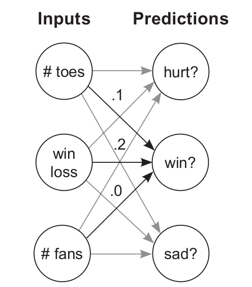
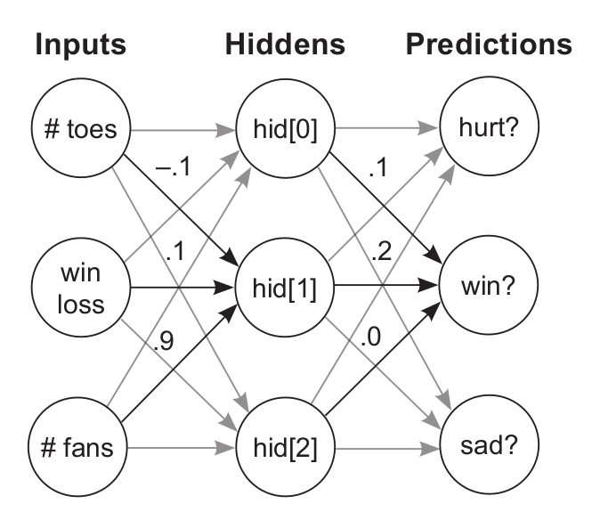

# 03. Forward Propagation

---

The number of datapoints you process at a time has a significant
impact on what a network looks like.

You can create a network only after you understand the shape of the input and output datasets.

# Simple NN

```python
weight = 0.1

def neural_network(input, weight):
	prediction = input * weight
	return prediction

number_of_toes = [8.5, 9.5, 10, 9]
input = number_of_toes[0]
pred = neural_network(input,weight)
print(pred)
```

**What is a NN?** For now, 

> It is one or more weights that you can multiply by the input data to make a prediction
> 

### How does the network learn?

Trial and error! First, it tries to make a prediction. Then, it sees whether the prediction was too
high or too low. Finally, it **changes the weight (up or down)** to predict more accurately the
next time it sees the same input.

### What does basic NN do?

Multiplies input by a weight. It scales the input by a certain amount.

The interface for a neural network is simple. It accepts an `input` variable as *information* and a
`weight` variable as *knowledge* and outputs a prediction.

# NN with multiple Inputs

NN with multiple inputs at a time, combine various forms in information to make better predictions.

```python
weights = [0.1, 0.2, 0]

def neural_network(input, weights):
	pred = w_sum(input,weights)
	return pred

def w_sum(a,b):
	assert(len(a) == len(b))
	output = 0
	for i in range(len(a)):
		output += (a[i] * b[I])
	return output

toes = [8.5, 9.5, 9.9, 9.0]
wlrec = [0.65, 0.8, 0.8, 0.9]
nfans = [1.2, 1.3, 0.5, 1.0]

input = [toes[0],wlrec[0],nfans[0]]
pred = neural_network(input,weights)
print(pred)
```

We multiply each input by its respective weight and then sum all the local predictions together. This is called a **weighted sum**(or dot product) of the input.

Vectors are list of numbers. Inputs and weights in above example are vecrtors.

A Dot Product gives a notion of similarity between two vectors.

In the following example, highest weighted sum(`w_sum(c,c)`) is between identical vectors, whereas lowest weighted sum is between (a,b) and (c,e). 

```python
a = [0,1,0,1]
b = [1,0,1,0]
c = [0,1,1,0]
d = [.5,0,.5,0]
e = [0,1,-1,0]
```

```python
w_sum(a,b) = 0
w_sum(b,c) = 1
w_sum(b,d) = 1
w_sum(c,c) = 2
w_sum(d,d) = .5
w_sum(c,e) = 0
```

**NN makes a prediction? What does it mean?**

Roughly speaking, it means the network gives a high score of the inputs based on how
similar they are to the weights.

## NumPy code for multiple Inputs NN

```python
import numpy as np

weights = np.array([0.1, 0.2, 0])

def neural_network(input, weights):
	pred = input.dot(weights)
	return pred

toes = np.array([8.5, 9.5, 9.9, 9.0])
wlrec = np.array([0.65, 0.8, 0.8, 0.9])
nfans = np.array([1.2, 1.3, 0.5, 1.0])

input = np.array([toes[0],wlrec[0],nfans[0]])
pred = neural_network(input,weights)
print(pred)
```

# NN with multiple Outputs

```python
def ele_mul(number,vector):
	output = [0,0,0]
	assert(len(output) == len(vector))
	for i in range(len(vector)):
		output[i] = number * vector[i]
	return output

def neural_network(input, weights):
	pred = ele_mul(input,weights)
	return pred

wlrec = [0.65, 0.8, 0.8, 0.9]
input = wlrec[0]
pred = neural_network(input,weights)
```

# NN with multiple Inputs & Outputs

A weight connects each input node to each output node.



```python
def w_sum(a,b):
	assert(len(a) == len(b))
	output = 0
	for i in range(len(a)):
		output += (a[i] * b[I])
	return output

def vect_mat_mul(vect,matrix):
	assert(len(vect) == len(matrix))
	output = [0,0,0]
	
	for i in range(len(vect)):
		output[i] = w_sum(vect,matrix[I])

	return output

def neural_network(input, weights):
	pred = vect_mat_mul(input,weights)
	return pred

toes = [8.5, 9.5, 9.9, 9.0]
wlrec = [0.65,0.8, 0.8, 0.9]
nfans = [1.2, 1.3, 0.5, 1.0]

input = [toes[0],wlrec[0],nfans[0]]
pred = neural_network(input,weight)
```

In this NN, each output node takes its own weighted sum of the input and makes a prediction.

Matrix is a list of Vectors.

# Predicting on predictions: Multi-layered NNs

Neural Networks can be stacked. The output of one network will be used as input of the next network.



```python
import numpy as np

# toes % win # fans
ih_wgt = np.array([
		[0.1, 0.2, -0.1], # hid[0]
		[-0.1,0.1, 0.9], # hid[1]
		[0.1, 0.4, 0.1]]).T # hid[2]

# hid[0] hid[1] hid[2]
hp_wgt = np.array([
		[0.3, 1.1, -0.3], # hurt?
		[0.1, 0.2, 0.0], # win?
		[0.0, 1.3, 0.1] ]).T # sad?

weights = [ih_wgt, hp_wgt]

def neural_network(input, weights):
	hid = input.dot(weights[0])
	pred = hid.dot(weights[1])
	return pred

toes = np.array([8.5, 9.5, 9.9, 9.0])
wlrec = np.array([0.65,0.8, 0.8, 0.9])
nfans = np.array([1.2, 1.3, 0.5, 1.0])

input = np.array([toes[0],wlrec[0],nfans[0]])
pred = neural_network(input,weights)
```

# Forward Propagation

Everything discussed above is what's called **Forward Propagation**.

It’s called this because you’re propagating activations forward through the network. In these examples, activations are all the numbers that are not weights and are unique for every prediction.

---