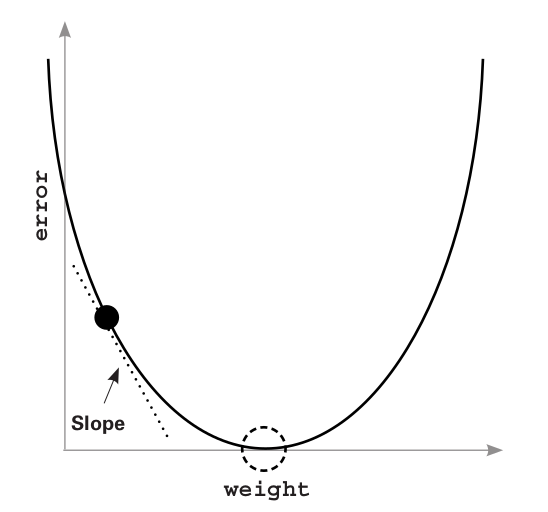
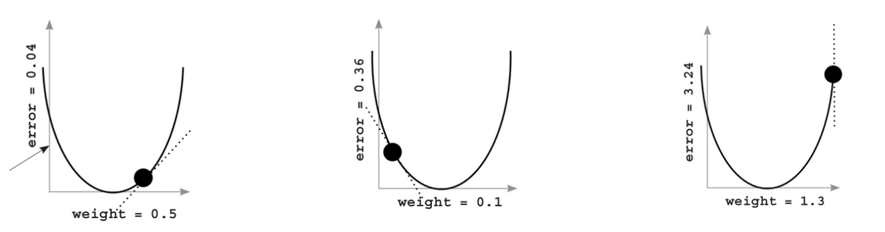

# 04. Gradient Descent

This chapter deals with Mean Squared Error only.

## Compare

This step comes after the Predict step, discussed in the previous chapter. 

This step tells how much the prediction was correct or incorrect. It doesn't tell why/how it was incorrect, and what could be done to improve.

The degree of error is always positive.

## Learn

This comes after the Compare step. 

---

## Measuring error

```python
knob_weight = 0.5
input = 0.5
goal_pred = 0.8
pred = input * knob_weight
error = (pred - goal_pred) ** 2
print(error)
```

**Why is error squared?**  

Because we want the error to be a positive value.

By squaring, big errors(>1) get bigger, and small errors(<1) get smaller/irrelevant. This way we prioritize big errors over small ones.

**Why do we only want a positive value of error?**

We want the average error to go down to 0. However, if the error is, for eg. 1000 and -1000, it creates a problem. 

## Simplest form of Neural Learning

**Hot and cold method**: Changing the weights up & down to see which direction reduces the error
the most, moving the weights in that direction and repeating until the error gets to 0.

```python
weight = 0.5
input = 0.5
goal_prediction = 0.8

step_amount = 0.001

for iteration in range(1101):

		prediction = input * weight
    error = (prediction - goal_prediction) ** 2

    print("Error:" + str(error) + " Prediction:" + str(prediction))
    
    up_prediction = input * (weight + step_amount)
    up_error = (goal_prediction - up_prediction) ** 2

    down_prediction = input * (weight - step_amount)
    down_error = (goal_prediction - down_prediction) ** 2

    if(down_error < up_error):
        weight = weight - step_amount
        
    if(down_error > up_error):
        weight = weight + step_amount
```

However the above method is inefficient and its sometimes impossible to predict the exact goal prediction.

## Gradient Descent : Calculating both direction and amount from error

```python
weight = 0.5
goal_pred = 0.8
input = 0.5

for iteration in range(20):
  pred = input * weight
  error = (pred - goal_pred) ** 2
  direction_and_amount = (pred - goal_pred) * input
  weight = weight - direction_and_amount
  
  print("Error:" + str(error) + " Prediction:" + str(pred))
```

This is Gradient descent. In a single line we calculate the direction and amount by which `weight` should change.

`direction_and_amount` is *pure error*. Multiplying it by `input` performs scaling, negative reversal, and stopping.

**Stopping:** When `input` is 0, `direction_and_amount` is also 0. There is nothing to learn. So there is no change in `weight`.

**Negative reversal**: When `input` is positive, moving `weight` up, makes prediction go up too. But when `input` is negative, this becomes vice versa (weight changes direction so moving weight up makes prediction go down). By multiplying *pure error* by input we overcome this and this is called negative reversal.

**Scaling**: When input is big, weight update should also be big. 

## One iteration of gradient descent

Another code where we use new variables `delta` and `alpha`.

```python
weight = 0.1
alpha = 0.01

def neural_network(input, weight):
	prediction = input * weight
	return prediction

number_of_toes = [8.5]
win_or_lose_binary = [1] # (won!!!)
input = number_of_toes[0]
goal_pred = win_or_lose_binary[0]

pred = neural_network(input,weight)
error = (pred - goal_pred) ** 2

delta = pred - goal_pred
weight_delta = input * delta
weight -= weight_delta * alpha
```

`delta` is a measurement of how much this node missed.

`weight_delta` is a measure of how much a weight caused the network to miss. 

We multiply `weight_delta` by small number `alpha` before before using it to update weight. This lets you control how fast the network learns. If it learns too fast, it can update weights too
aggressively and overshoot.

So for now, 

```python
weight, goal_pred, input = (0.0, 0.8, 0.5)

for iteration in range(4):
	pred = input * weight
	error = (pred - goal_pred) ** 2  # error = ((0.5 * weight) - 0.8) ** 2
	delta = pred - goal_pred
	weight_delta = delta * input
	weight = weight - weight_delta
	print("Error:" + str(error) + " Prediction:" + str(pred))
```

For any `input` and `goal_pred`, exact relationship is defined between `error` and `weight`.

**`error = ((0.5 * weight) - 0.8) ** 2`**



We modify specific parts(like weight) of an error function until the error value goes to 0.

**Key takeaway**
You can modify anything in the `pred` calculation except `input`

---

# Derivatives

**Derivative** represents the direction and the amount that one variable changes if you change the other variable.

*“It’s the sensitivity between two variables”. Positive sensitivity (when variables move together), Negative sensitivity (when they move in opposite directions), and Zero sensitivity (when one stays fixed regardless of what you do to the other).*

With derivatives, you can pick any two variables in any formula, and know how they interact.

For any *error function* in a NN (no matter how complicated), you can compute the relationship between any *weight* and the *final error* of the network using derivatives. By knowing the relationship you can change each *weight* in the NN to reduce the *error* down to 0.

# Gradient Descent

We use the derivative to determine the relationship between any weight and error. We then move the weight in the opposite direction of the derivative to find the lowest weight. Then the NN learns!

This method of learning is called Gradient Descent.

We move the weight value opposite the gradient value, which reduces error to 0. By opposite, I mean you increase the weight when you have a negative gradient, and vice versa.

In the previous code example, `weight_delta` was our derivative.

## Divergence

When is input becomes larger, the weight update is even larger even if the error is small. Because of this new large weight update, the network overreacts and the new error is big. Now the network overreacts even more. This is Divergence.



The error is very sensitive to the weight. In other words, the derivative is really big.

### Alpha

Solution to Divergence is to multiply the weight by a fraction by to make it smaller. This fraction is a single real valued number between 0 & 1, Alpha.

```python
weight = 0.5
goal_pred = 0.8
input = 2
alpha = 0.1

for iteration in range(20):
	pred = input * weight
	error = (pred - goal_pred) ** 2
	derivative = input * (pred - goal_pred)
	weight = weight - (alpha * derivative)

	print("Error:" + str(error) + " Prediction:" + str(pred))
```

In the above example we have a larger `input` , but multiplying the derivative(weight_delta) by the alpha decreases the weight update, preventing it from overshooting. 

Finding perfect alpha is a guessing game. There are more advanced ways, but for now just try (10, 1, 0.1, 0.01, 0.001, 0.0001) and then tweak it from there.

---