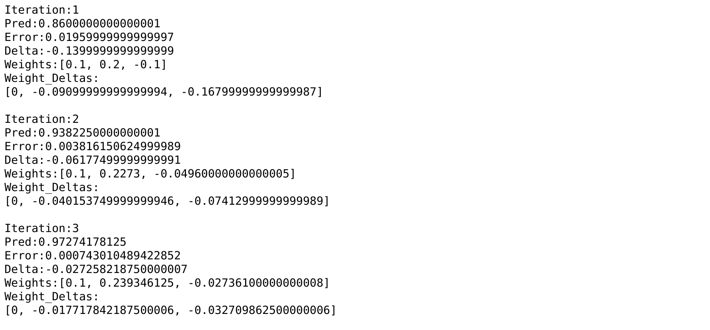

# 05. Generalizing Gradient Descent

# Gradient Descent with Multiple inputs

```python
def w_sum(a,b):
    assert(len(a) == len(b))
    output = 0

    for i in range(len(a)):
        output += (a[i] * b[i])

    return output

def neural_network(input,weights):
    pred = w_sum(input,weights)
    return pred

def ele_mul(number,vector):
    output = [0,0,0]

    assert(len(output) == len(vector))

    for i in range(len(vector)):
        output[i] = number * vector[i]

    return output

toes =  [8.5, 9.5, 9.9, 9.0]
wlrec = [0.65, 0.8, 0.8, 0.9]
nfans = [1.2, 1.3, 0.5, 1.0]
win_or_lose_binary = [1, 1, 0, 1]

weights = [0.1, 0.2, -.1] 
alpha = 0.01

true = win_or_lose_binary[0]
input = [toes[0],wlrec[0],nfans[0]]

pred = neural_network(input,weights)
error = (pred - true) ** 2
delta = pred - true
weight_deltas = ele_mul(delta,input)

for i in range(len(weights)):
    weights[i] -= alpha * weight_deltas[i]
    
print("Weights:" + str(weights))
print("Weight Deltas:" + str(weight_deltas))
```


`delta` is a measure of how much you want a node’s value to be different. Positive `delta` means the node's value is too high, negative delta indicates that nodes value is too low.

Based on the `delta`, each `weight` goes through *stopping, negative reversal, and scaling* with respect to its own `input`. *Stopping, negative reversal, and scaling* make an observation of how the `weight`’s role in `delta` was affected by its `input`.

Thus, each `weight_delta` is a sort of input-modified version of `delta`.

## Steps of Learning

```python
def neural_network(input, weights):
  out = 0
  for i in range(len(input)):
    out += (input[i] * weights[i])
  return out

def ele_mul(scalar, vector):
  out = [0,0,0]
  for i in range(len(out)):
    out[i] = vector[i] * scalar
  return out

toes =  [8.5, 9.5, 9.9, 9.0]
wlrec = [0.65, 0.8, 0.8, 0.9]
nfans = [1.2, 1.3, 0.5, 1.0]

win_or_lose_binary = [1, 1, 0, 1]
true = win_or_lose_binary[0]

alpha = 0.01
weights = [0.1, 0.2, -.1]
input = [toes[0],wlrec[0],nfans[0]]

for iter in range(3):

  pred = neural_network(input,weights)

  error = (pred - true) ** 2
  delta = pred - true

  weight_deltas=ele_mul(delta,input)

  print("Iteration:" + str(iter+1))
  print("Pred:" + str(pred))
  print("Error:" + str(error))
  print("Delta:" + str(delta))
  print("Weights:" + str(weights))
  print("Weight_Deltas:")
  print(str(weight_deltas))
  print(
  )

  for i in range(len(weights)):
    weights[i]-=alpha*weight_deltas[i]
```


`(a)` is steeper than other → it has higher derivative(`weight_delta`) even though a,b,c share same delta, because a has bigger input.

## Freezing one weight

```python
def neural_network(input, weights):
  out = 0
  for i in range(len(input)):
    out += (input[i] * weights[i])
  return out

def ele_mul(scalar, vector):
  out = [0,0,0]
  for i in range(len(out)):
    out[i] = vector[i] * scalar
  return out

toes =  [8.5, 9.5, 9.9, 9.0]
wlrec = [0.65, 0.8, 0.8, 0.9]
nfans = [1.2, 1.3, 0.5, 1.0]

win_or_lose_binary = [1, 1, 0, 1]
true = win_or_lose_binary[0]

alpha = 0.3
weights = [0.1, 0.2, -.1]
input = [toes[0],wlrec[0],nfans[0]]

for iter in range(3):

  pred = neural_network(input,weights)

  error = (pred - true) ** 2
  delta = pred - true

  weight_deltas=ele_mul(delta,input)
  weight_deltas[0] = 0

  print("Iteration:" + str(iter+1))
  print("Pred:" + str(pred))
  print("Error:" + str(error))
  print("Delta:" + str(delta))
  print("Weights:" + str(weights))
  print("Weight_Deltas:")
  print(str(weight_deltas))
  print(
  )

  for i in range(len(weights)):
    weights[i]-=alpha*weight_deltas[i]
```




Even though `weight[0]` is freezer, `(a)` finds the bottom. This is because → as the error is shared, so when one weight finds the bottom of the bowl, all the weights find the bottom of the bowl.

If the network accidentally figures out how to predict accurately on the training data without it, then it will never learn to incorporate it into its prediction.

# Gradient Descent with Multiple outputs

```python
weights = [0.3, 0.2, 0.9] 

def neural_network(input, weights):
    pred = ele_mul(input,weights)
    return pred

wlrec = [0.65, 1.0, 1.0, 0.9]

hurt  = [0.1, 0.0, 0.0, 0.1]
win   = [  1,   1,   0,   1]
sad   = [0.1, 0.0, 0.1, 0.2]

input = wlrec[0]
true = [hurt[0], win[0], sad[0]]

pred = neural_network(input,weights)

error = [0, 0, 0] 
delta = [0, 0, 0]

for i in range(len(true)):
    error[i] = (pred[i] - true[i]) ** 2
    delta[i] = pred[i] - true[i]
    
def scalar_ele_mul(number,vector):
    output = [0,0,0]

    assert(len(output) == len(vector))

    for i in range(len(vector)):
        output[i] = number * vector[i]

    return output

weight_deltas = scalar_ele_mul(input,delta)

alpha = 0.1

for i in range(len(weights)):
    weights[i] -= (weight_deltas[i] * alpha)
    
print("Weights:" + str(weights))
print("Weight Deltas:" + str(weight_deltas))
```


`weight_deltas` share the same input node and have unique output nodes (`deltas`).

# Gradient Descent with Multiple inputs & outputs

```python
import numpy as np

def w_sum(a,b):
    assert(len(a) == len(b))
    output = 0

    for i in range(len(a)):
        output += (a[i] * b[i])

    return output

def vect_mat_mul(vect,matrix):
    assert(len(vect) == len(matrix))
    output = [0,0,0]
    for i in range(len(vect)):
        output[i] = w_sum(vect,matrix[i])
    return output

def neural_network(input, weights):
    pred = vect_mat_mul(input,weights)
    return pred

toes  = [8.5, 9.5, 9.9, 9.0]
wlrec = [0.65,0.8, 0.8, 0.9]
nfans = [1.2, 1.3, 0.5, 1.0]

hurt  = [0.1, 0.0, 0.0, 0.1]
win   = [  1,   1,   0,   1]
sad   = [0.1, 0.0, 0.1, 0.2]

weights = [ [0.1, 0.1, -0.3],#hurt?
            [0.1, 0.2, 0.0], #win?
            [0.0, 1.3, 0.1] ]#sad?

alpha = 0.01

input = [toes[0],wlrec[0],nfans[0]]
true  = [hurt[0], win[0], sad[0]]

pred = neural_network(input,weights)

error = [0, 0, 0] 
delta = [0, 0, 0]

for i in range(len(true)):
    error[i] = (pred[i] - true[i]) ** 2
    delta[i] = pred[i] - true[i]

def outer_prod(a, b):
    
    # just a matrix of zeros
    out = np.zeros((len(a), len(b)))

    for i in range(len(a)):
        for j in range(len(b)):
            out[i][j] = a[i] * b[j]
    return out

weight_deltas = outer_prod(delta,input)

for i in range(len(weights)):
    for j in range(len(weights[0])):
        weights[i][j] -= alpha * weight_deltas[i][j]

print(weights)
```


# Visualizing weight values

visualize the weights as if they were an image.

**Dot Product**: They take two vectors, multiply them together (element-wise),
and then sum over the output.


A dot product is a loose measurement of similarity between two vectors.


In the above example, if the weight vector is similar to the input vector for 2, then it will output a high score(0.98) because the two vectors are similar. Inversely, if the weight vector is not similar to the input vector for 2, it will output a low score(0.01).

## Gradient descent is a general learning algorithm

If you combine weights in a way that allows you to calculate an error function and a delta , gradient descent can show you how to move the weights to reduce the error.