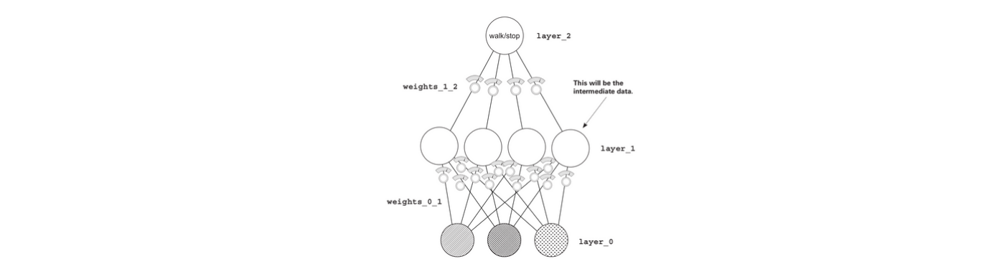
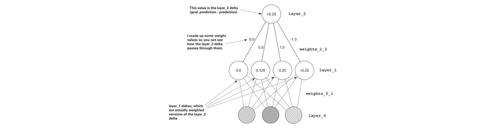
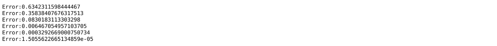

# 06. Introduction to Back Propagation

# Preparing the Data

We need to have two datasets - 1) what you know, and 2) what you want to know.

This input data pattern is what you want the NN to learn to transform into the output data pattern. To learn the output data pattern, we need to capture the input pattern in terms of **matrices**.

In data matrices, a **row** represents *each recorded sample*, whereas a **column** represents the *thing that is being recorded.*

The matrices as a whole express a pattern, and not just the "value" in its rows.

# Matrices in Python

Using the NumPy library, we create arrays of arrays because it provides many matrix-oriented functions.

```python
import numpy as np
streetlights = np.array( [[ 1, 0, 1 ],
                          [ 0, 1, 1 ],
                          [ 0, 0, 1 ],
                          [ 1, 1, 1 ],
                          [ 0, 1, 1 ],
                          [ 1, 0, 1 ] ] )
```

# Building a NN for whole dataset

```python
import numpy as np

weights = np.array([0.5,0.48,-0.7])
alpha = 0.1

streetlights = np.array( [[ 1, 0, 1 ],
                          [ 0, 1, 1 ],
                          [ 0, 0, 1 ],
                          [ 1, 1, 1 ],
                          [ 0, 1, 1 ],
                          [ 1, 0, 1 ] ] )

walk_vs_stop = np.array( [ 0, 1, 0, 1, 1, 0 ] )

input = streetlights[0] # [1,0,1]
goal_prediction = walk_vs_stop[0] # equals 0... i.e. "stop"

for iteration in range(40):
    error_for_all_lights = 0
    for row_index in range(len(walk_vs_stop)):
        input = streetlights[row_index]
        goal_prediction = walk_vs_stop[row_index]
        
        prediction = input.dot(weights)
        
        error = (goal_prediction - prediction) ** 2
        error_for_all_lights += error
        
        delta = prediction - goal_prediction
        weights = weights - (alpha * (input * delta))	
        print("Prediction:" + str(prediction))
    print("Error:" + str(error_for_all_lights) + "\n")
```

# Full, batch, and stochastic gradient descent

### Stochastic Gradient Descent

This method updates the weight one training example at a time.

i.e. it makes a prediction for one training example, updates the weights for it, and moves on to the next example. Then it iterates through the dataset many times until it finds a configuration that works best for all examples.

### Full Gradient Descent

Instead of updating the weights one example at a time, it takes the average `weight_delta` over the entire training dataset, and then updates the weight only after each iteration.

### Batch Gradient Descent

Instead of updating the weights after just one example or after the entire dataset of examples, you choose a batch size (typically between 8 and 256) of examples, after which the weights are updated.

# NN and Correlation

NNs try to identify which input correlated with the output.

Adjusting the weights to reduce the error over a series of training examples ultimately searches for correlation between the input and the output layers. If no correlation exists, then the error will never reach 0.

# Up and Down pressure

How do networks identify correlation? In the process of gradient descent, each training example asserts either *up pressure* or *down pressure* on the weights.

A key part of why neural networks learn is error attribution, which means given a shared error, the network needs to figure out which weights contributed (so they can be adjusted) and which weights did not contribute (so they can be left alone) to that shared error.

**Conclusion**
_The prediction is a weighted sum of the inputs. The learning algorithm rewards inputs that
correlate with the output with upward pressure (toward 1) on their weight while penalizing
inputs with decorrelation with downward pressure. The weighted sum of the inputs find perfect correlation between the input and the output by weighting decorrelated inputs to 0._

# Edge Cases: Overfitting

Error is shared among all the weights. If a particular configuration of weights accidentally creates perfect correlation between the prediction and the output dataset (such that error == 0) without giving the heaviest weight to the best inputs, the neural network will stop learning.

Finding this "wrong" correlation accidentally is called **overfitting**. 

# Creating correlation

When there is no correlation between input and output layers, the solution is to create two of these networks. The first one will create an intermediate dataset that has a limited correlation with the output, and the second will use that limited correlation to correctly predict the output.

We basically stack two NNs on top of each other. Middle layer of nodes represents the intermediate dataset.



Consider the above image.

What’s the prediction from `layer_1` to `layer_2`? It’s a weighted average of the values at
`layer_1`. If `layer_2` is too high by x amount, the with higher weights in `layer_1` contributed more and the ones with lower weights contributed less.

The weights from `layer_1` to `layer_2` exactly describe how much each `layer_1` node contributes to the `layer_2` prediction. This means those weights also exactly describe how much each `layer_1` node contributes to the `layer_2` error.

# Backpropagation: Long-distance error attribution

How do you use the delta at `layer_2` to figure out the delta at `layer_1`? You multiply it by each of the respective weights for `layer_1`. It’s like the prediction logic in reverse. This **process of moving the delta signal around is called backpropagation**.



# Linear vs. nonlinear

We have stacked two NNs, but there arises a problem

**Problem**
_For every three-layer neural network, there would be a two layered neural network that would do the exact same thing. This is the same case for any stacked neural network. The problem here is we are wasting a lot of resources when we stack networks._

Sometimes the layer should be correlated and sometimes it should not be correlated at all. This gives the middle layer the opportunity to not just be x% or y& correlated to the input but to be not at all correlated or be correlated.

This is called **conditional correlation** or **sometimes correlation**.

**Solution**
_By turning off any middle node whenever it would be negative, you allow the
network to sometimes subscribe to correlation from various inputs. This is impossible for two-layer neural networks, thus adding power to three-layer nets._

**Non-Linearity**: The logic “if the node would be negative, set it to 0” is called non linearity.

**Linearity:** Without the above logic, it is linear.

Consecutive matrix multiplication is a linear transformation. Without the non-linearity, two matrix multiplications might as well be 1.

# Deep Neural Network

```python
import numpy as np

np.random.seed(1)

def relu(x):
    return (x > 0) * x # returns x if x > 0
                       # return 0 otherwise

def relu2deriv(output):
    return output>0 # returns 1 for input > 0
                    # return 0 otherwise
alpha = 0.2
hidden_size = 4

weights_0_1 = 2*np.random.random((3,hidden_size)) - 1
weights_1_2 = 2*np.random.random((hidden_size,1)) - 1

for iteration in range(60):
   layer_2_error = 0
   for i in range(len(streetlights)):
      layer_0 = streetlights[i:i+1]
      layer_1 = relu(np.dot(layer_0,weights_0_1))
      layer_2 = np.dot(layer_1,weights_1_2)

      layer_2_error += np.sum((layer_2 - walk_vs_stop[i:i+1]) ** 2)

      layer_2_delta = (walk_vs_stop[i:i+1] - layer_2)
      layer_1_delta=layer_2_delta.dot(weights_1_2.T)*relu2deriv(layer_1)     #This line computes the delta at layer_1 by taking the layer_2_delta and multiplying it by its connecting weights_1_2.

      weights_1_2 += alpha * layer_1.T.dot(layer_2_delta)
      weights_0_1 += alpha * layer_0.T.dot(layer_1_delta)

   if(iteration % 10 == 9):
      print("Error:" + str(layer_2_error)
```



Backpropagation is about calculating *deltas* for intermediate layers so we can perform gradient descent. To do so, we take the weighted average delta on `layer_2` for `layer_1` (weighted by the weights in between them). We then turn off (set to 0) nodes that weren’t participating in the forward prediction, because they couldn’t have contributed to the error.

---