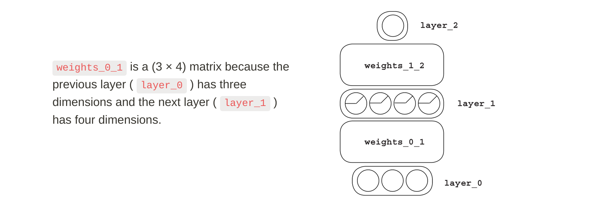
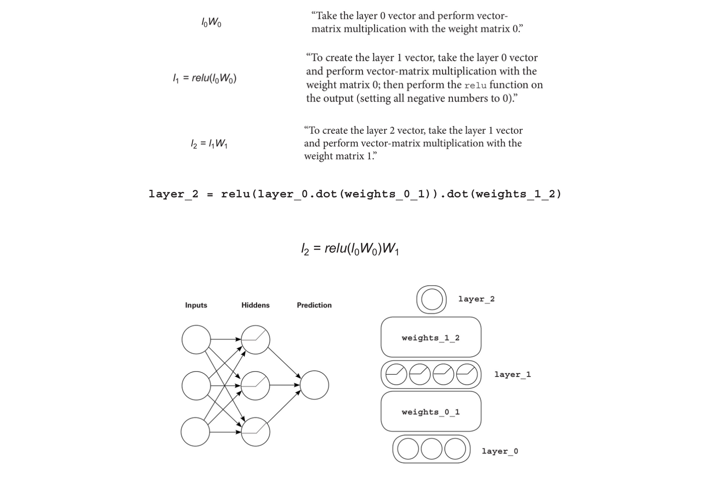

# 07. How to Picture a Neural Network

# Simplified Visualization

Neural networks are like LEGO bricks, and each brick is a vector or matrix, and the dimensionality of the matrices is determined by the layers.

The particular configuration of layers and weights in a neural network is called its **architecture.**

Good neural architectures channel signal so that correlation is easy to discover. Great architectures also filter noise to help prevent overfitting.

# Using Variables instead of Images

We use letters to indicate functions and operations. Vector-matrix multiplication is simple. To visualize that two letters are being multiplied by each other, put them next to each other.

## Visualization and Architecture

A neural architecture controls how signal flows through a network. The ways in which the network can detect correlation depends on this architecture.

---