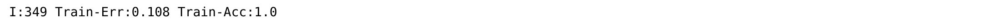
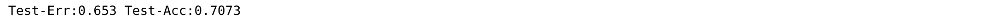
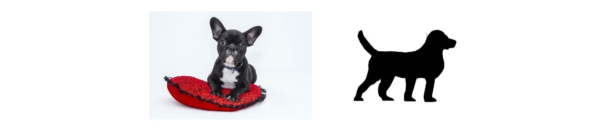

# 08. Regularization and Batching

## Overfitting

Overfitting happens when the network learns the detail and noise in the training data to the extent that it negatively impacts its performance on the new dataset. This means that the noise or random fluctuations in the training data is picked up and learned as concepts by the model.

In more simple words,

The network figures out a way to accurately predict on the training dataset, but it somehow forgets to include a valuable input or shows preference to some inputs (there are many more examples like these).

Overfitting and Underfitting are the biggest problems of NNs.

### MNIST dataset training

Lets train a 3 layered ReLU NN on MNIST dataset

```python
import sys, numpy as np
from keras.datasets import mnist

(x_train, y_train), (x_test, y_test) = mnist.load_data()

images, labels = (x_train[0:1000].reshape(1000,28*28) / 255, y_train[0:1000])

one_hot_labels = np.zeros((len(labels),10))
for i,l in enumerate(labels):
    one_hot_labels[i][l] = 1
labels = one_hot_labels

test_images = x_test.reshape(len(x_test),28*28) / 255
test_labels = np.zeros((len(y_test),10))
for i,l in enumerate(y_test):
    test_labels[i][l] = 1
    
np.random.seed(1)
relu = lambda x:(x>=0) * x # returns x if x > 0, return 0 otherwise
relu2deriv = lambda x: x>=0 # returns 1 for input > 0, return 0 otherwise
alpha, iterations, hidden_size, pixels_per_image, num_labels = (0.005, 350, 40, 784, 10)

weights_0_1 = 0.2*np.random.random((pixels_per_image,hidden_size)) - 0.1
weights_1_2 = 0.2*np.random.random((hidden_size,num_labels)) - 0.1

for j in range(iterations):
    error, correct_cnt = (0.0, 0)
    
    for i in range(len(images)):
        layer_0 = images[i:i+1]
        layer_1 = relu(np.dot(layer_0,weights_0_1))
        layer_2 = np.dot(layer_1,weights_1_2)

        error += np.sum((labels[i:i+1] - layer_2) ** 2)
        correct_cnt += int(np.argmax(layer_2) == \
                                        np.argmax(labels[i:i+1]))

        layer_2_delta = (labels[i:i+1] - layer_2)
        layer_1_delta = layer_2_delta.dot(weights_1_2.T)\
                                    * relu2deriv(layer_1)
        weights_1_2 += alpha * layer_1.T.dot(layer_2_delta)
        weights_0_1 += alpha * layer_0.T.dot(layer_1_delta)

    sys.stdout.write("\r I:"+str(j)+ \
                     " Train-Err:" + str(error/float(len(images)))[0:5] +\
                     " Train-Acc:" + str(correct_cnt/float(len(images))))
```



Accuracy becomes 1. However we only trained it over 1000 training examples. Let's test it on a new test sample from MNIST.

```python
if(j % 10 == 0 or j == iterations-1):
    error, correct_cnt = (0.0, 0)

    for i in range(len(test_images)):

        layer_0 = test_images[i:i+1]
        layer_1 = relu(np.dot(layer_0,weights_0_1))
        layer_2 = np.dot(layer_1,weights_1_2)

        error += np.sum((test_labels[i:i+1] - layer_2) ** 2)
        correct_cnt += int(np.argmax(layer_2) == \
                                        np.argmax(test_labels[i:i+1]))
    sys.stdout.write(" Test-Err:" + str(error/float(len(test_images)))[0:5] +\
                     " Test-Acc:" + str(correct_cnt/float(len(test_images))) + "\n")
    print()
```



The test accuracy is only 70%.

What happened here was that the NN worked only a small set of data and when a new unidentical image came, it couldn't predict with accuracy.

#### NN get worse on overtraining

When we look at the training & testing accuracy of a NN, we observe that the accuracy goes up initially, then goes down as it is trained more and more.

### Overfitting

NN that has learned the noise in the dataset instead of making decisions based only on the true signal.

As the network is trained more and more, it learns the detailed information of the training data which is incompatible with the test data. This is called **Noise**. 

For a better example, consider the following images



Both of these are dog images. The things that make these images unique beyond what captures the essence of "dog" are included in the term noise. 

Left: Background, pillow, furry texture, etc are noise.

Right: Empty blackness in the middle of the dog is also noise.

We want the NN to only focus on **Signal**, i.e. the essence of the dog. 

The solution to overfitting is **Regularization**.

### Regularization

Regularization is a subset of methods used to encourage generalization in learned models, often by increasing the difficulty for a model to learn the fine-grained details of training data.
Helps the neural network learn the signal and ignore the noise.

## Early Stopping

This is the simplest regularization.

How do we get a neural network to ignore the fine-grained detail and capture only the general information present in the data (general shape of a dog or of an MNIST digit)? We don’t let the network train long enough to learn it.

## Dropout

During training, we randomly set neurons in the network to 0 (usually the deltas on the same nodes during backpropagation, but we technically don’t have to). This causes the neural network to train
exclusively using *random subsections* of the neural network.

### Why Dropout works?

*Dropout makes a big network act like a little one by randomly training little subsections
of the network at a time, and little networks don’t overfit.*

Dropout is a form of training a bunch of networks and averaging them.

**Important #1**
*Although it’s likely that large, unregularized neural networks will overfit to noise, it’s unlikely they will overfit to the same noise.*

**Important #2**
*Neural networks, even though they’re randomly generated, still start by learning the biggest, most broadly sweeping features before learning much about the noise.*

#### Dropout Code

We add the following to the previous code.

```python
i = 0
layer_0 = images[i:i+1]
dropout_mask = np.random.randint(2,size=layer_1.shape)

layer_1 *= dropout_mask * 2
layer_2 = np.dot(layer_1, weights_1_2)

error += np.sum((labels[i:i+1] - layer_2) ** 2)

correct_cnt += int(np.argmax(layer_2) == np.argmax(labels[i+i+1]))

layer_2_delta = (labels[i:i+1] - layer_2)
layer_1_delta = layer_2_delta.dot(weights_1_2.T) * relu2deriv(layer_1)

layer_1_delta *= dropout_mask

weights_1_2 += alpha * layer_1.T.dot(layer_2_delta)
weights_0_1 += alpha * layer_0.T.dot(layer_1_delta)
```

We multiply the `layer_1` values by a random matrix of 1s and 0s. This randomly turns off nodes in `layer_1`by setting them to equal 0. `dropout_mask` uses what’s called a 50% Bernoulli
distribution(50% times, each value in `dropout_mask` is 1, and other 50% times, it’s 0.

We then multiply `layer_1` by 2. This is because `layer_2` will perform a weighted sum of `layer_1`. If we turn off half the nodes in `layer_1`, that sum will be cut in half. Thus, `layer_2` would increase its sensitivity to `layer_1`. We counter this by multiplying `layer_1` by (1 / percentage of turned on nodes) i.e. 1/0.5, which is 2. This way, the volume of `layer_1` is the same between training and testing, despite dropout.

The following is the full code is with dropout

 

```python
import numpy, sys
np.random.seed(1)
def relu(x):
    return (x >= 0) * x # returns x if x > 0
                        # returns 0 otherwise

def relu2deriv(output):
    return output >= 0 #returns 1 for input > 0

alpha, iterations, hidden_size = (0.005, 300, 100)
pixels_per_image, num_labels = (784, 10)

weights_0_1 = 0.2*np.random.random((pixels_per_image,hidden_size)) - 0.1
weights_1_2 = 0.2*np.random.random((hidden_size,num_labels)) - 0.1

for j in range(iterations):
    error, correct_cnt = (0.0,0)
    for i in range(len(images)):
        layer_0 = images[i:i+1]
        layer_1 = relu(np.dot(layer_0,weights_0_1))
        dropout_mask = np.random.randint(2, size=layer_1.shape)
        layer_1 *= dropout_mask * 2
        layer_2 = np.dot(layer_1,weights_1_2)

        error += np.sum((labels[i:i+1] - layer_2) ** 2)
        correct_cnt += int(np.argmax(layer_2) == np.argmax(labels[i:i+1]))
        layer_2_delta = (labels[i:i+1] - layer_2)
        layer_1_delta = layer_2_delta.dot(weights_1_2.T) * relu2deriv(layer_1)
        layer_1_delta *= dropout_mask

        weights_1_2 += alpha * layer_1.T.dot(layer_2_delta)
        weights_0_1 += alpha * layer_0.T.dot(layer_1_delta)

    if(j%10 == 0):
        test_error = 0.0
        test_correct_cnt = 0

        for i in range(len(test_images)):
            layer_0 = test_images[i:i+1]
            layer_1 = relu(np.dot(layer_0,weights_0_1))
            layer_2 = np.dot(layer_1, weights_1_2)

            test_error += np.sum((test_labels[i:i+1] - layer_2) ** 2)
            test_correct_cnt += int(np.argmax(layer_2) == np.argmax(test_labels[i:i+1]))

        sys.stdout.write("\n" + \
                         "I:" + str(j) + \
                         " Test-Err:" + str(test_error/ float(len(test_images)))[0:5] +\
                         " Test-Acc:" + str(test_correct_cnt/ float(len(test_images)))+\
                         " Train-Err:" + str(error/ float(len(images)))[0:5] +\
                         " Train-Acc:" + str(correct_cnt/ float(len(images))))
```

We see that on adding dropout, now the test accuracy is 82%. Dropout also slowed down training accuracy , which previously went straight to 100% and stayed there.

So it means that dropout is actually just noise, which makes it more difficult for the network to train.

## Batch Gradient Descent

In the following code, we train 100 examples at a time averaging the weight updates among all 100 examples.

```python
import numpy as np
np.random.seed(1)

def relu(x):
    return (x >= 0) * x # returns x if x > 0

def relu2deriv(output):
    return output >= 0 # returns 1 for input > 0

batch_size = 100
alpha, iterations = (0.001, 300)
pixels_per_image, num_labels, hidden_size = (784, 10, 100)

weights_0_1 = 0.2*np.random.random((pixels_per_image,hidden_size)) - 0.1
weights_1_2 = 0.2*np.random.random((hidden_size,num_labels)) - 0.1

for j in range(iterations):
    error, correct_cnt = (0.0, 0)
    for i in range(int(len(images) / batch_size)):
        batch_start, batch_end = ((i * batch_size),((i+1)*batch_size))

        layer_0 = images[batch_start:batch_end]
        layer_1 = relu(np.dot(layer_0,weights_0_1))
        dropout_mask = np.random.randint(2,size=layer_1.shape)
        layer_1 *= dropout_mask * 2
        layer_2 = np.dot(layer_1,weights_1_2)

        error += np.sum((labels[batch_start:batch_end] - layer_2) ** 2)
        for k in range(batch_size):
            correct_cnt += int(np.argmax(layer_2[k:k+1]) == np.argmax(labels[batch_start+k:batch_start+k+1]))

            layer_2_delta = (labels[batch_start:batch_end]-layer_2)/batch_size
            layer_1_delta = layer_2_delta.dot(weights_1_2.T)* relu2deriv(layer_1)
            layer_1_delta *= dropout_mask

            weights_1_2 += alpha * layer_1.T.dot(layer_2_delta)
            weights_0_1 += alpha * layer_0.T.dot(layer_1_delta)
            
    if(j%10 == 0):
        test_error = 0.0
        test_correct_cnt = 0

        for i in range(len(test_images)):
            layer_0 = test_images[i:i+1]
            layer_1 = relu(np.dot(layer_0,weights_0_1))
            layer_2 = np.dot(layer_1, weights_1_2)

            test_error += np.sum((test_labels[i:i+1] - layer_2) ** 2)
            test_correct_cnt += int(np.argmax(layer_2) == np.argmax(test_labels[i:i+1]))

        sys.stdout.write("\n" + \
                         "I:" + str(j) + \
                         " Test-Err:" + str(test_error/ float(len(test_images)))[0:5] +\
                         " Test-Acc:" + str(test_correct_cnt/ float(len(test_images)))+\
                         " Train-Err:" + str(error/ float(len(images)))[0:5] +\
                         " Train-Acc:" + str(correct_cnt/ float(len(images))))
```

In this method, the training accuracy has a smoother trend. Individual training examples are very noisy in terms of the weight updates they generate. Thus, averaging them makes for a smoother learning process.

Also, batching makes the network train faster. When batching, the `alpha` is also larger usually.