# 09. Activation Functions

What are Activation functions? Well, its a function applied to the neurons
in a layer during prediction.

## Constraints for Activation functions

### 1. Continuous & Infinite domain

A proper activation function must have an output number for any input. Its graph should be continuous and infinite. 

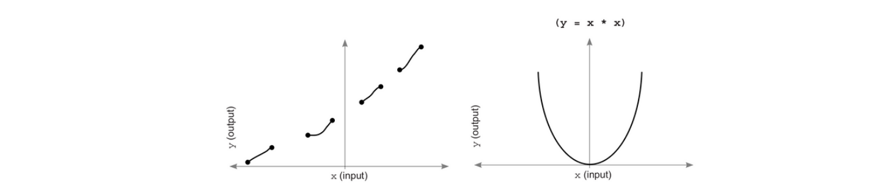

The graph on the left is not a suitable activation function.

### 2. Monotonic - never changing direction

The function should be one-one, i.e. it must either be always increasing or decreasing.

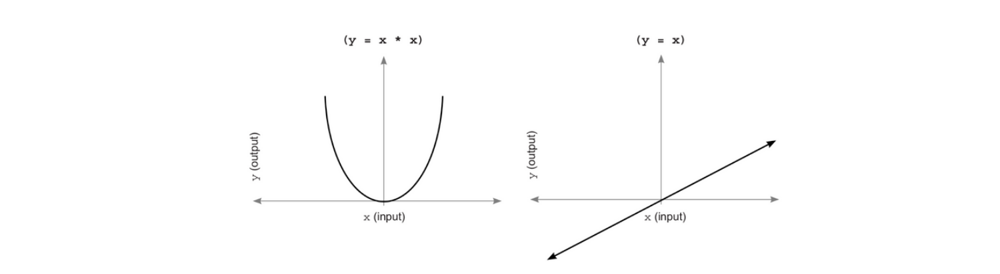

The graph on the left has two values of x for a single y. This creates a problem as now the network will have multiple "right configurations". 

However, this constraint isn't technically a requirement as non-monotonous functions can be optimized.

### 3. Non-Linear

Good activation functions are non-linear.

The "selective correlation" that the network wants to achieve is only possible by functions that curve. On the other hand, functions that look like straight lines scale the weighted average coming in, which is doesn't affect correlation at all. Only curved lines can do this.

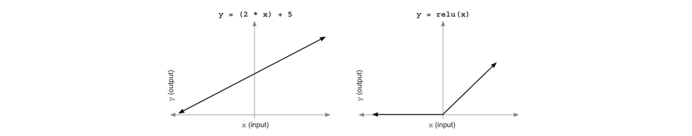

The graph on the left is a linear function, whereas the one on the right is non-linear and better.

### 4. Efficiently computable

Good activation functions and their derivatives should be easy and fast to compute(as we'll be calling them billions of times).

## Standard Hidden layer Activation Functions

There are many good activation functions, some of them are -

### Sigmoid

It smoothly squishes an infinite amount of input to an output between 0 & 1, which lets us interpret the output of a neuron as a probability. It is used both in hidden and output layers.

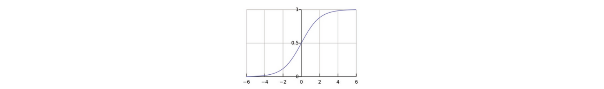

### Tanh

Tanh is better than Sigmoid for hidden layers. This is because tanh also has both positive and negative correlation (i.e. between -1 & 1) whereas sigmoid only has positive correlation (i.e. between 0 & 1). This isn't as useful for output layers but better for hidden layers.

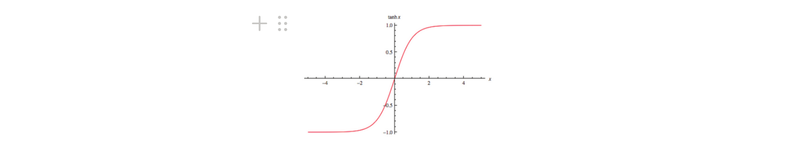

## Standard Output layer Activation Functions

What's best for output layer activation functions can be different from what's best for hidden layer activation functions. There are 3 major types of output layer -

### 1. Predicting raw data values (no activation fn)

Least common type of output layer where we will need to transform one matrix of numbers into another matrix, where the range output is something other than probability(ex. predicting avg. temperature in one place based on the temperature in other states). So here we train the network without activation function on the output.

### 2. Predicting unrelated yes/no probabilities (sigmoid)

For these types of problems (predicting whether the team won or not and was happy or not), Sigmoid activation function is best to use. Also, when a NN has hidden layers, predicting multiple things at once is beneficial (predicting one label helps predict other labels too).

### 3. Classification probabilities (softmax)

Softmax is preferred over sigmoid. 

Softmax gives the probability of one label as highest, and 0 for other labels, which is not the case with the sigmoid.

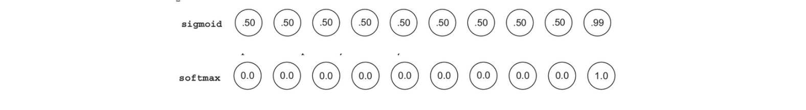

In sigmoid, this causes problems when we backpropagate. 

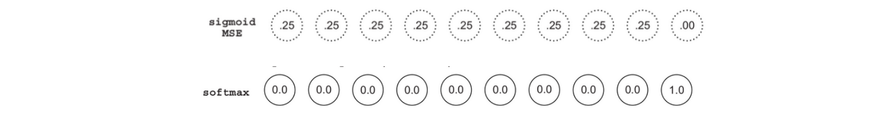

We see that sigmoid has so much error, so its weights will be updated again. Whereas softmax's prediction is perfect. Hence we use softmax.

## Similarity in Inputs

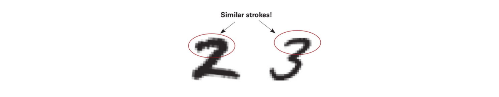

If we forward propagate the 2 and a small amount of probability accidentally goes to the label 3, Sigmoid will penalize the network for recognizing a 2 by anything other than features that are exclusively related to 2. We don't want this.

We want the network to understand these similarities and not penalize the network when similarity is found. Therefore softmax is used, and all it's probabilities sum to 1.

## Softmax Computation

Softmax raises each input value exponentially and then divides by the layer’s sum.

Consider the raw input values below

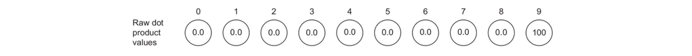

To compute softmax we raise each value exponentially ($e^x$, see graph below)

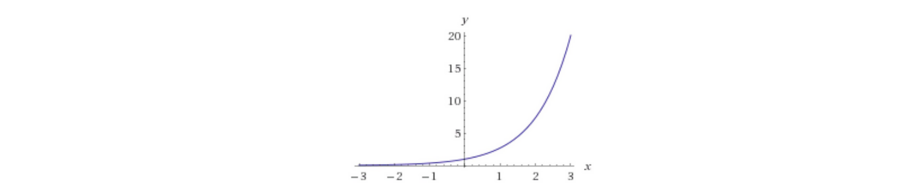

It turns negative numbers into very small positive numbers, and positive numbers into large positive numbers, (in short, turns all 0s to 1s, and 100 to a very large number, and negative numbers to between 0 & 1.

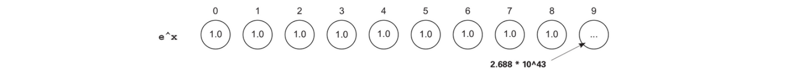

Then it sums all the nodes in the layer and divides each value in the layer by that sum. This effectively makes every number 0 except the value for the correct label.

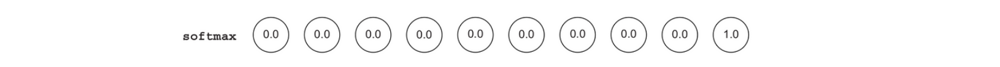

Softmax is that the higher the network predicts one value, the lower it predicts all the others. It increases what is called the *sharpness of attenuation*.

Use numbers slightly higher or lower than e when exponentiation, for lower *attenuation* and higher *attenuation* respectively.

## Adding activation function to any layer

ReLU in a hidden layer in forward propagation. 

```python
layer_0 = images[i:i+1]
layer_1 = relu(np.dot(layer_0,weights_0_1))
layer_2 = np.dot(layer_1,weights_1_2)
```

Slope of ReLU for positive numbers is 1, and for negative numbers its 0. This slope is a measure of how much the output of relu will change given a change in its input.

When we backpropagate, to generate `layer_1_delta` , multiply the backpropagated delta from `layer_2 ( layer_2_delta.dot(weights_1_2.T) )` by the slope of ReLU at the point predicted in forward propagation.

```python
error += np.sum((labels[i:i+1] - layer_2) ** 2)
correct_cnt += int(np.argmax(layer_2) == np.argmax(labels[i:i+1]))
layer_2_delta = (labels[i:i+1] - layer_2)
layer_1_delta = layer_2_delta.dot(weights_1_2.T) * relu2deriv(layer_1)
weights_1_2 += alpha * layer_1.T.dot(layer_2_delta)
weights_0_1 += alpha * layer_0.T.dot(layer_1_delta)
def relu(x):
	return (x >= 0) * x 

def relu2deriv(output):
	return output >= 0
```

## Functions

`input` is a NumPy vector (corresponding to the input to a layer). `output` is the prediction of
the layer. `deriv` is the derivative of the vector of activation derivatives corresponding to the
derivative of the activation at each node. `true` is the vector of true values (typically 1 for the
correct label position, 0 everywhere else).

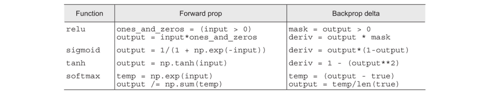

`delta` computation for `softmax` is special because it’s used only for the last layer.

## Upgrading MNIST

`tanh` function is a better hidden-layer activation, and softmax is a better output-layer activation function. However we tweaked few things here.

For `tanh` we reduce the standard deviation of the incoming weights to between –0.01 and 0.01. We removed error calculation. `tanh` works best with `cross entrophy` error function. Also we increased the `alpha`.

```python
import numpy as np, sys
np.random.seed(1)

from keras.datasets import mnist

(x_train, y_train), (x_test, y_test) = mnist.load_data()

images, labels = (x_train[0:1000].reshape(1000,28*28) / 255, y_train[0:1000])

one_hot_labels = np.zeros((len(labels),10))
for i,l in enumerate(labels):
    one_hot_labels[i][l] = 1
labels = one_hot_labels

test_images = x_test.reshape(len(x_test),28*28) / 255
test_labels = np.zeros((len(y_test),10))
for i,l in enumerate(y_test):
    test_labels[i][l] = 1

def tanh(x):
    return np.tanh(x)

def tanh2deriv(output):
    return 1 - (output ** 2)

def softmax(x):
    temp = np.exp(x)
    return temp / np.sum(temp, axis=1, keepdims=True)

alpha, iterations, hidden_size = (2, 300, 100)
pixels_per_image, num_labels = (784, 10)
batch_size = 100

weights_0_1 = 0.02*np.random.random((pixels_per_image,hidden_size))-0.01
weights_1_2 = 0.2*np.random.random((hidden_size,num_labels)) - 0.1

for j in range(iterations):
    correct_cnt = 0
    for i in range(int(len(images) / batch_size)):
        batch_start, batch_end=((i * batch_size),((i+1)*batch_size))
        layer_0 = images[batch_start:batch_end]
        layer_1 = tanh(np.dot(layer_0,weights_0_1))
        dropout_mask = np.random.randint(2,size=layer_1.shape)
        layer_1 *= dropout_mask * 2
        layer_2 = softmax(np.dot(layer_1,weights_1_2))

        for k in range(batch_size):
            correct_cnt += int(np.argmax(layer_2[k:k+1]) == np.argmax(labels[batch_start+k:batch_start+k+1]))

        layer_2_delta = (labels[batch_start:batch_end]-layer_2) / (batch_size * layer_2.shape[0])
        layer_1_delta = layer_2_delta.dot(weights_1_2.T) * tanh2deriv(layer_1)
        layer_1_delta *= dropout_mask

        weights_1_2 += alpha * layer_1.T.dot(layer_2_delta)
        weights_0_1 += alpha * layer_0.T.dot(layer_1_delta)

    test_correct_cnt = 0

    for i in range(len(test_images)):

        layer_0 = test_images[i:i+1]
        layer_1 = tanh(np.dot(layer_0,weights_0_1))
        layer_2 = np.dot(layer_1,weights_1_2)

        test_correct_cnt += int(np.argmax(layer_2) == np.argmax(test_labels[i:i+1]))
    if(j % 10 == 0):
        sys.stdout.write("\n"+ \
         "I:" + str(j) + \
         " Test-Acc:"+str(test_correct_cnt/float(len(test_images)))+\
         " Train-Acc:" + str(correct_cnt/float(len(images))))
```