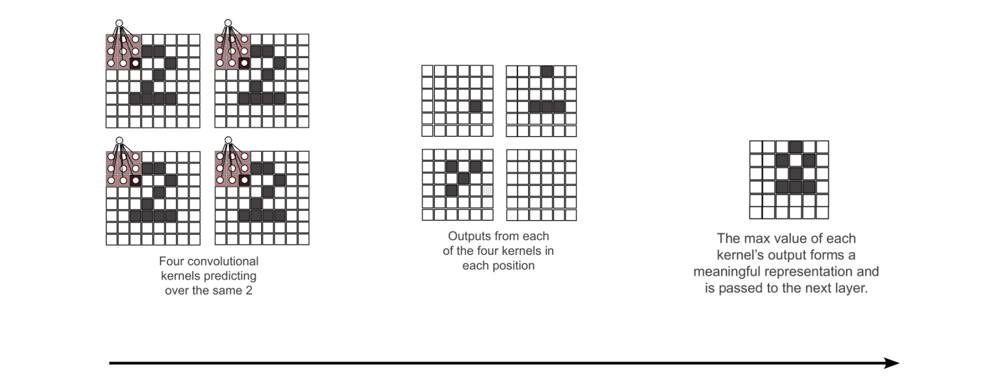

# 10. Intro to Convolutional Neural Networks

## Reusing Weights in multiple places

Overfitting is concerned with the ratio between the number of weights in the model and the number of datapoints it has to learn those weights.

Regularization is means of countering overfitting, but there are many more. A better method is **Structure**.

**Structure**: When we selectively choose to reuse weights for multiple purposes in a NN because we believe the same pattern needs to be detected in multiple places. This reduces the *weight-to-data ratio*, and in turn, reduces overfitting.

## The Convolutional Layer

***Lots of very small linear layers are reused in every position, instead of a single big one.***

The core idea behind a convolutional layer is that instead of having a large, dense linear layer with a connection from every input to every output, you instead have lots of very small linear layers, (usually with fewer than 25 inputs and a single output), which you use in every input position. Each mini-layer is called a convolutional kernel.

This technique allows each kernel to learn a particular pattern and then search for the existence of that pattern somewhere in the image.

A single, small set of weights can train over a much larger set of training examples, because even though the Four convolutional datasets hasn’t changed, each mini-kernel is kernels predicting
forward propagated multiple times on multiple over the same 2 segments of data, thus changing the ratio of weights to datapoints on which those weights are being trained. This has a powerful impact on the network, drastically reducing its ability to overfit to training data and increasing its ability to generalize.
